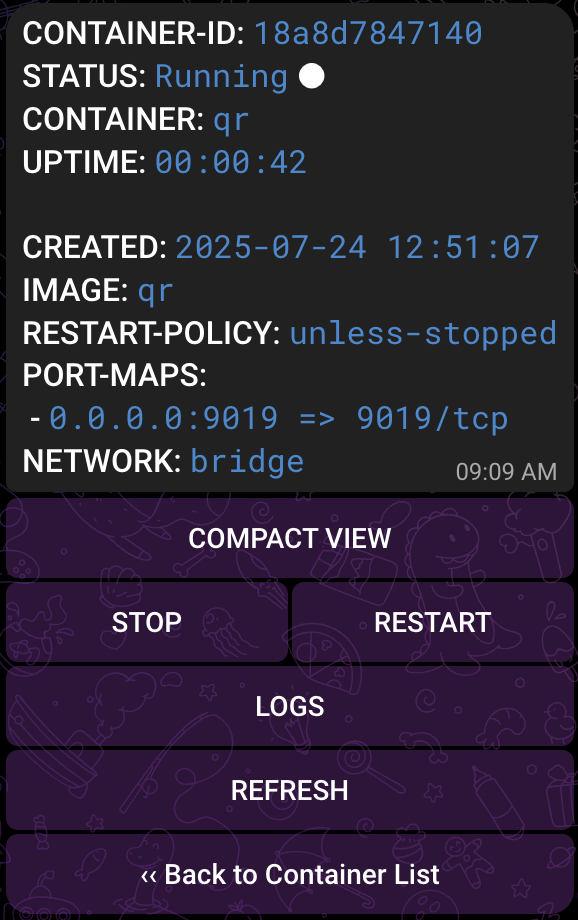
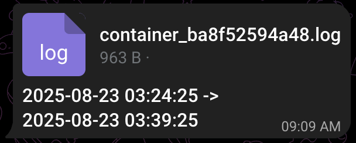

# Screenshots

  
  
Real-time updates

---

  
  
List of containers (container <code>qr</code> is not running)

---

  
  
Stopped container

---

  
  
Running container

---

  
  
Detailed view

---

  
  
Logs options

---

  
  
Logs by time

---

  
  
Log file

